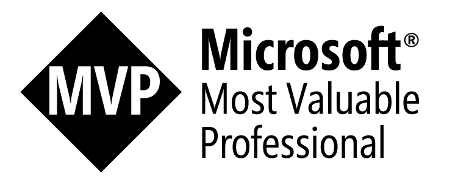

<div align="center">
  

  # `> jorgeasaurus`

  **Endpoint Platform Engineer** · **Microsoft MVP — PowerShell**

  *Enterprise-scale endpoint management through intelligent automation and strategic innovation.*

  <a href="https://linkedin.com/in/jorgeasaurus"></a>
  <a href="https://www.jorgeasaur.us"></a>

  <br />

  
</div>


## 🚀 Featured Projects

| Project | Description | Stack |
| :--- | :--- | :---: |
| **[graphexplorerplus](https://github.com/jorgeasaurus/graphexplorerplus)** | Power-user alternative to Microsoft Graph Explorer | `Next.js` |
| **[errorindex](https://github.com/jorgeasaurus/errorindex)** | Searchable reference for Microsoft error codes  | `HTML` |
| **[FleetDM-PowerShell](https://github.com/jorgeasaurus/FleetDM-PowerShell)** | Native PowerShell interface for managing FleetDM| `Pwsh` |
| **[agent-skills](https://github.com/jorgeasaurus/agent-skills)** | Reusable Copilot agent skills for PowerShell development workflows | `Pwsh` |
| **[WinStoreRip](https://github.com/jorgeasaurus/WinStoreRip)** | Query and download Windows Store app packages from the command line | `Pwsh` |
| **[WingetIntunePublisher](https://github.com/jorgeasaurus/WingetIntunePublisher)** | PowerShell module for automating WinGet app packaging to Intune | `Pwsh` |
| **[PSModuleBrowser](https://github.com/jorgeasaurus/PSModuleBrowser)** | Browse and discover PowerShell modules with a streamlined interface | `Pwsh` |
| **[IntuneDocsAutomation](https://github.com/jorgeasaurus/IntuneDocsAutomation)** | Editorial-style dashboard that auto-tracks the latest Microsoft Intune updates | `HTML` |
| **[MgGraphIndex](https://github.com/jorgeasaurus/MgGraphIndex)** | Searchable reference for all 24,000+ Microsoft Graph PowerShell cmdlets | `HTML` |
| **[NukeTune](https://www.NukeTune.com)** | Web-based Intune bulk deletion — nuke it all in one shot | `Webapp` |
| **[Intune Hydration Kit](https://github.com/jorgeasaurus/IntuneHydrationKit)** | Bootstrap greenfield Intune tenants with boilerplate configs| `Pwsh` |
| **[Intune-Snapshot-Recovery](https://github.com/jorgeasaurus/Intune-Snapshot-Recovery)** | Automated backup & restore pipeline for Intune tenant configurations | `Pwsh` |
| **[PsJamfBackupRestore](https://github.com/jorgeasaurus/PsJamfBackupRestore)** | DR solution for Jamf Pro — version-control macOS management objects | `Pwsh` |
| **[MgConsoleGuiGraphSearch](https://github.com/jorgeasaurus/MgConsoleGuiGraphSearch)** | Terminal UI for querying Microsoft 365 & Entra ID via Graph API | `Pwsh` |

---

## 🛡️ Certifications

[](https://learn.microsoft.com/api/credentials/share/en-us/JorgeSuarez-7408/A2B291647B02D103?sharingId=5EFF7C32EF47CA0D)
[](https://learn.microsoft.com/api/credentials/share/en-us/JorgeSuarez-7408/F41320F517848E99?sharingId=5EFF7C32EF47CA0D)
[](https://account.jamf.com/training-courses/certificate/tVCte1XUW74S0_U994fQCg)

---

## 🧰 Tech Stack

<table>
  <tr>
    <td align="center"><b>Languages</b><br/>
      
      
    </td>
    <td align="center"><b>Endpoint &amp; Identity</b><br/>
      
      
      
      
    </td>
  </tr>
  <tr>
    <td align="center"><b>DevOps</b><br/>
      
      
      
      
    </td>
    <td align="center"><b>Security &amp; Telemetry</b><br/>
      
      
    </td>
  </tr>
  <tr>
    <td colspan="2" align="center"><b>Fleet OS Coverage</b><br/>
      
      
      
      
      
    </td>
  </tr>
</table>

---

## ✍️ Recent Publications

- [Using .NET Methods in PowerShell (with practical examples you'll actually reuse)](https://www.jorgeasaur.us/using-net-methods-in-powershell-with-practical-examples-youll-actually-reuse)
- [Bootstrap Your Intune Tenant in a Single Command](https://www.jorgeasaur.us/bootstrap-your-intune-tenant-in-a-single-command)
- [Finding WMI Usage Before Microsoft Finds It For You](https://www.jorgeasaur.us/finding-wmi-usage-before-microsoft-finds-it-for-you)
- [Are you even good enough to have Imposter Syndrome?](https://www.jorgeasaur.us/are-you-even-good-enough-to-have-imposter-syndrome/)

---

<div align="center">

```powershell
PS C:\> Write-Host "Eat. Sleep. Code. Repeat."
```

</div>
