<div align="center">
  

  <br />
  <br />

  

  # Jorge Suarez

  ### Endpoint platform engineer. Microsoft MVP. PowerShell builder for Intune, Graph, and fleet automation.

  I turn messy endpoint operations into repeatable systems: tenant hydration, Graph-powered tooling, package automation, recovery workflows, and terminal-first admin experiences.

  <a href="https://www.jorgeasaur.us"></a>
  <a href="https://linkedin.com/in/jorgeasaurus"></a>
  <a href="https://github.com/jorgeasaurus?tab=repositories"></a>

  <br />
  <br />

  
</div>

---

## What I build

I design practical tooling for the people who keep fleets healthy: endpoint engineers, Intune admins, PowerShell developers, and IT pros who would rather automate the boring work than repeat it.

| Focus | I ship |
| :--- | :--- |
| **Intune acceleration** | Greenfield tenant bootstrapping, bulk operations, backup/restore workflows, Win32 app packaging, policy recovery |
| **PowerShell systems** | Modules, terminal UIs, Graph integrations, operational scripts, reusable agent skills |
| **Microsoft Graph clarity** | Search tools, command indexes, Graph-powered admin experiences, government cloud compatibility contributions |
| **Community enablement** | Technical writing, open-source projects, podcast appearances, practical walkthroughs for real operators |

---

## Flagship work

<table>
  <tr>
    <td width="50%" valign="top">
      <h3><a href="https://github.com/jorgeasaurus/IntuneHydrationKit">IntuneHydrationKit</a></h3>
      <p>Bootstrap a greenfield Intune tenant with baseline policies, compliance settings, dynamic groups, and starter configuration in a single PowerShell-driven flow.</p>
      <p><b>Why it matters:</b> compresses hours of tenant setup into a repeatable, auditable command.</p>
      <p><code>PowerShell</code> <code>Intune</code> <code>Microsoft Graph</code> <code>134 stars</code></p>
    </td>
    <td width="50%" valign="top">
      <h3><a href="https://github.com/jorgeasaurus/InTUI">InTUI</a></h3>
      <p>A terminal user interface for Microsoft Intune management, built with PowerShell and Spectre Console on top of Graph API workflows.</p>
      <p><b>Why it matters:</b> brings fast, keyboard-driven administration to work usually trapped behind portals.</p>
      <p><code>PowerShell</code> <code>TUI</code> <code>Graph API</code> <code>35 stars</code></p>
    </td>
  </tr>
  <tr>
    <td width="50%" valign="top">
      <h3><a href="https://www.NukeTune.com">NukeTune</a></h3>
      <p>A web-based Intune bulk-deletion tool for removing devices, apps, policies, and configurations when a tenant needs a clean reset.</p>
      <p><b>Why it matters:</b> turns high-risk cleanup work into a purpose-built, intentional workflow.</p>
      <p><code>Next.js</code> <code>Intune</code> <code>Bulk operations</code></p>
    </td>
    <td width="50%" valign="top">
      <h3><a href="https://jorgeasaurus.github.io/MgGraphIndex/">MgGraphIndex</a></h3>
      <p>An interactive, searchable reference for 24,000+ Microsoft Graph PowerShell cmdlets with no backend, framework, or build step.</p>
      <p><b>Why it matters:</b> makes the Graph PowerShell surface area discoverable when autocomplete is not enough.</p>
      <p><code>HTML</code> <code>PowerShell</code> <code>Microsoft Graph</code></p>
    </td>
  </tr>
</table>

---

## More tools from the lab

| Project | Built for | Stack |
| :--- | :--- | :---: |
| **[WingetIntunePublisher](https://github.com/jorgeasaurus/WingetIntunePublisher)** | Package and deploy WinGet apps to Intune as Win32 apps, including group and remediation setup | `PowerShell` |
| **[Intune-Snapshot-Recovery](https://github.com/jorgeasaurus/Intune-Snapshot-Recovery)** | Back up and restore Intune tenant configuration through GitHub Actions and scripts | `PowerShell` |
| **[IntuneDocsAutomation](https://github.com/jorgeasaurus/IntuneDocsAutomation)** | Track Microsoft Intune documentation changes in an editorial-style dashboard | `HTML` |
| **[MgConsoleGuiGraphSearch](https://github.com/jorgeasaurus/MgConsoleGuiGraphSearch)** | Query Microsoft 365 and Entra ID objects through a console GUI | `PowerShell` |
| **[FleetDM-PowerShell](https://github.com/jorgeasaurus/FleetDM-PowerShell)** | Manage FleetDM from native PowerShell commands | `PowerShell` |
| **[PsJamfBackupRestore](https://github.com/jorgeasaurus/PsJamfBackupRestore)** | Version-control Jamf Pro objects for macOS management recovery | `PowerShell` |
| **[agent-skills](https://github.com/jorgeasaurus/agent-skills)** | Reusable Copilot agent skills for PowerShell engineering workflows | `PowerShell` |
| **[WinStoreRip](https://github.com/jorgeasaurus/WinStoreRip)** | Query and download Windows Store app packages from the command line | `PowerShell` |
| **[errorindex](https://github.com/jorgeasaurus/errorindex)** | Search Microsoft error codes from a static reference site | `HTML` |

---

## Proof of work

<table>
  <tr>
    <td width="33%" valign="top">
      <h3>Microsoft MVP</h3>
      <p>Recognized in PowerShell, with community contributions across Intune, Microsoft Graph, automation, and practical operator education.</p>
    </td>
    <td width="33%" valign="top">
      <h3>Open source impact</h3>
      <p>Projects include tenant hydration, Intune recovery, package publishing, Graph command discovery, and endpoint management TUIs.</p>
    </td>
    <td width="33%" valign="top">
      <h3>Community signal</h3>
      <p>Blog author, PowerShell Podcast guest, and contributor to tools including PowerShell, Graph X-Ray, and IntuneAssignmentChecker.</p>
    </td>
  </tr>
</table>

### Recent publications

- [Using .NET Methods in PowerShell (with practical examples you'll actually reuse)](https://www.jorgeasaur.us/using-net-methods-in-powershell-with-practical-examples-youll-actually-reuse)
- [Bootstrap Your Intune Tenant in a Single Command](https://www.jorgeasaur.us/bootstrap-your-intune-tenant-in-a-single-command)
- [Finding WMI Usage Before Microsoft Finds It For You](https://www.jorgeasaur.us/finding-wmi-usage-before-microsoft-finds-it-for-you)
- [Are you even good enough to have Imposter Syndrome?](https://www.jorgeasaur.us/are-you-even-good-enough-to-have-imposter-syndrome/)

### Certifications

<p>
  <a href="https://learn.microsoft.com/api/credentials/share/en-us/JorgeSuarez-7408/A2B291647B02D103?sharingId=5EFF7C32EF47CA0D"></a>
  <a href="https://learn.microsoft.com/api/credentials/share/en-us/JorgeSuarez-7408/F41320F517848E99?sharingId=5EFF7C32EF47CA0D"></a>
  <a href="https://account.jamf.com/training-courses/certificate/tVCte1XUW74S0_U994fQCg"></a>
</p>

---

## Tools I reach for

<p>
  
  
  
  
  
  
  
  
  
  
  
</p>

---

## GitHub signal

<div align="center">
  
  
  <br />
  
</div>

---

<div align="center">

```powershell
PS> Invoke-Impact -Through Automation -For "People who run the fleet"
```

<sub>Building the tools I wish existed when the portal got slow, the tenant got messy, or the fleet needed answers now.</sub>

</div>
